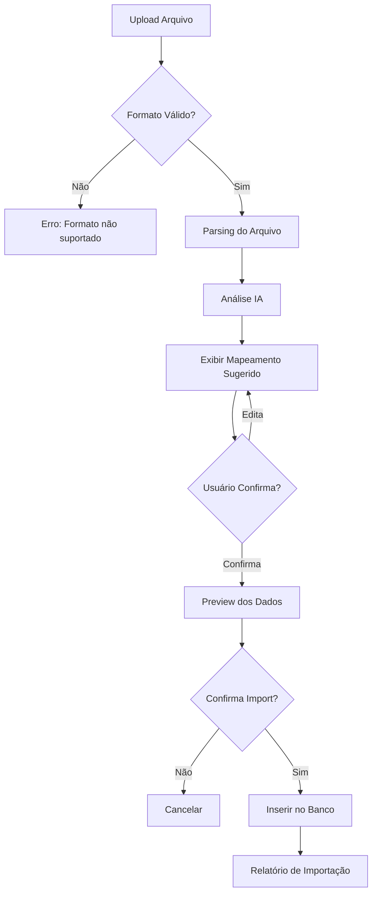

# 📤 Sprint 2: Upload de Tabelas + IA

> **Status:** ✅ Concluída  
> **Prioridade:** Alta  
> **Dependências:** Sprint 1 (Autenticação) - Opcional

---

## 🎯 Objetivo

Criar um sistema de importação de leads via upload de arquivos (CSV/Excel) com processamento inteligente por IA para mapear e organizar os dados automaticamente nos kanbans corretos.

---

## 📋 Requisitos Funcionais

### RF-01: Interface de Upload
- [ ] Área de drag & drop para arquivos
- [ ] Suporte a formatos: CSV, XLSX, XLS
- [ ] Feedback visual de progresso
- [ ] Validação de formato antes do processamento

### RF-02: Parsing de Arquivos
- [ ] Extração de dados de CSVs
- [ ] Extração de dados de planilhas Excel
- [ ] Detecção automática de encoding (UTF-8, ISO-8859-1)
- [ ] Tratamento de diferentes separadores (;, ,, \t)

### RF-03: Mapeamento Inteligente (IA)
- [ ] Análise dos headers da tabela
- [ ] Sugestão de mapeamento para campos do Lead
- [ ] Identificação de formato de dados (telefone, CNPJ, email)
- [ ] Normalização automática de dados

### RF-04: Preview & Confirmação
- [ ] Exibir preview dos dados mapeados
- [ ] Permitir correção manual do mapeamento
- [ ] Exibir alertas de dados inválidos
- [ ] Contagem de registros a importar

### RF-05: Inserção no Sistema
- [ ] Criar leads no banco de dados
- [ ] Atribuir ao usuário logado (owner)
- [ ] Definir status inicial (INBOX)
- [ ] Detectar e tratar duplicatas (por CNPJ/email)
- [ ] Log de importação com resultados

---

## 🏗️ Arquitetura Proposta

```
client/
├── app/
│   ├── api/
│   │   └── import/
│   │       ├── upload/route.ts    # Upload e parsing
│   │       ├── analyze/route.ts   # Análise com IA
│   │       └── confirm/route.ts   # Inserção final
├── components/
│   └── import/
│       ├── UploadZone.tsx         # Área de drag & drop
│       ├── MappingEditor.tsx      # Editor de mapeamento
│       ├── ImportPreview.tsx      # Preview dos dados
│       └── ImportProgress.tsx     # Barra de progresso
└── lib/
    └── services/
        ├── file-parser.ts         # Parsing CSV/Excel
        └── ai-mapper.ts           # Mapeamento com IA
```

---

## 🤖 Lógica de IA para Mapeamento

### Campos do Sistema

| Campo Lead | Aliases Esperados |
|------------|-------------------|
| `company_name` | razão social, empresa, nome empresa |
| `trade_name` | nome fantasia, fantasia |
| `cnpj` | cnpj, documento |
| `phone` | telefone, tel, fone, celular |
| `email` | email, e-mail, contato |
| `city` | cidade, municipio |
| `uf` | uf, estado |
| `decision_maker` | decisor, responsável, contato |

### Prompt de Mapeamento (Exemplo)

```
Analise os seguintes headers de uma planilha e mapeie para os campos do sistema.

Headers da planilha: {headers}

Campos disponíveis: company_name, trade_name, cnpj, phone, email, city, uf, decision_maker, notes

Retorne um JSON com o mapeamento sugerido.
```

---

## 📊 Fluxo de Usuário



---

## ✅ Critérios de Aceite

1. [ ] Upload via drag & drop funciona com CSV e Excel
2. [ ] IA sugere mapeamento correto em >80% dos casos
3. [ ] Usuário pode ajustar mapeamento manualmente
4. [ ] Preview mostra dados corretamente formatados
5. [ ] Duplicatas são identificadas antes da inserção
6. [ ] Leads são criados com owner = usuário logado
7. [ ] Relatório final mostra: importados, duplicados, erros

---

## 🧪 Plano de Testes

### Arquivos de Teste Necessários
- [ ] CSV com headers em português
- [ ] CSV com headers em inglês
- [ ] Excel com múltiplas abas
- [ ] Arquivo com encoding diferente
- [ ] Arquivo com dados inválidos

### Testes Manuais
1. Upload de CSV padrão → mapeamento automático correto
2. Upload de Excel → parsing funciona
3. Editar mapeamento → preview reflete mudança
4. Importar com duplicatas → duplicatas são marcadas
5. Importar com sucesso → leads aparecem no Kanban

---

## ⏳ Pendente: Formato Exato

> **NOTA:** O usuário informou que enviará o formato exato das tabelas que serão importadas. Este documento será atualizado com:
> - Exemplo real de arquivo
> - Headers específicos esperados
> - Regras de negócio adicionais
