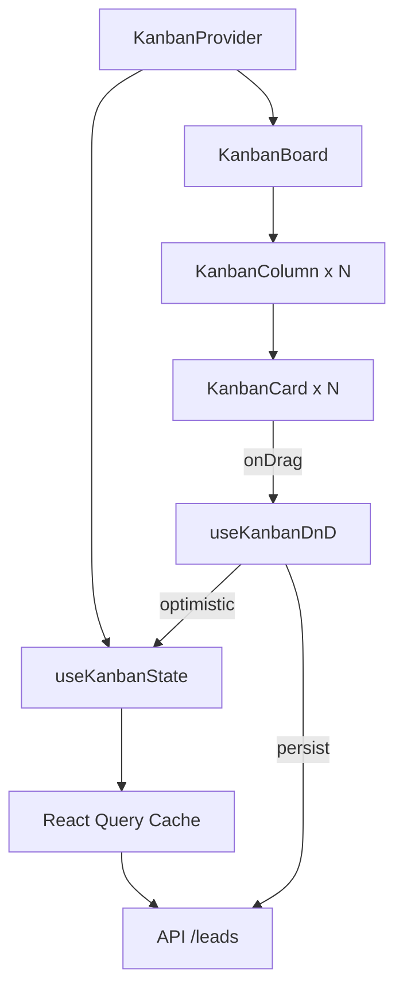

# 🔧 Sprint 9: Refatoração do Kanban

> **Status:** ✅ Concluída
> **Prioridade:** Alta
> **Dependências:** Nenhuma

---

## 🎯 Objetivo

Refatorar o componente Kanban para corrigir bugs existentes, melhorar performance e estabilidade. O layout dos cards será **mantido** nesta sprint.

---

## 🐛 Bugs Conhecidos

### Bugs a Investigar e Corrigir

| ID | Descrição | Severidade |
|----|-----------|------------|
| BUG-01 | Drag-and-drop não sincroniza corretamente o estado | Alta |
| BUG-02 | Cards duplicam visualmente após mover | Alta |
| BUG-03 | Estado não persiste após arrastar card | Alta |
| BUG-04 | Scroll conflita com drag em mobile | Média |
| BUG-05 | Performance degrada com muitos cards | Média |
| BUG-06 | Reordenação dentro da mesma coluna não funciona | Baixa |

> **NOTA:** Lista será expandida conforme investigação

---

## 📋 Requisitos de Refatoração

### RF-01: Correção de Drag-and-Drop
- [ ] Revisão completa do DnD-Kit
- [ ] Sincronização de estado otimista
- [ ] Rollback em caso de erro
- [ ] Feedback visual durante drag

### RF-02: Gerenciamento de Estado
- [ ] Separar estado local do servidor
- [ ] Implementar otimistic updates
- [ ] Cache de dados (React Query/SWR)
- [ ] Debounce de atualizações

### RF-03: Performance
- [ ] Memoização de componentes
- [ ] Virtualização de colunas longas
- [ ] Lazy loading de cards fora da viewport
- [ ] Reduzir re-renders desnecessários

### RF-04: Sincronização
- [ ] Atualização em tempo real
- [ ] Conflito de edição simultânea
- [ ] Indicador de "salvando..."
- [ ] Retry automático em falha

---

## 🏗️ Arquitetura Atual (Análise)

### Arquivos Envolvidos

```
client/
├── app/
│   └── page.tsx              # 1900+ linhas (PROBLEMA!)
├── components/
│   └── kanban/
│       ├── KanbanBoard.tsx   # Container do board
│       ├── KanbanColumn.tsx  # Coluna individual
│       └── KanbanCard.tsx    # Card de lead
└── lib/
    └── services/
        └── leads-service.ts  # Chamadas à API
```

### Problemas Identificados

1.  **page.tsx gigante:** 1900+ linhas misturando lógica e UI
2.  **Estado não isolado:** Estado do Kanban misturado com outros estados
3.  **Atualizações síncronas:** API calls bloqueiam a UI
4.  **Sem cache:** Cada ação refaz fetch completo

---

## 🎯 Arquitetura Proposta

### Separação de Responsabilidades

```
client/
├── app/
│   └── page.tsx              # < 200 linhas (apenas composição)
├── components/
│   └── kanban/
│       ├── KanbanProvider.tsx    # Context + Estado
│       ├── KanbanBoard.tsx       # Layout das colunas
│       ├── KanbanColumn.tsx      # Droppable zone
│       ├── KanbanCard.tsx        # Draggable card
│       └── hooks/
│           ├── useKanbanState.ts # Hook de estado
│           ├── useKanbanDnD.ts   # Hook de drag
│           └── useLeadSync.ts    # Hook de sync
└── lib/
    └── stores/
        └── kanban-store.ts   # Zustand store (opcional)
```

### Fluxo de Dados



---

## 🔄 Estratégia de Migração

### Fase 1: Extração de Lógica
1. [x] Extrair hooks customizados do `page.tsx`
2. [x] Criar `KanbanProvider` com context
3. [x] Mover estado para hooks isolados

### Fase 2: Otimização de DnD
1. [x] Revisar configuração do DnD-Kit
2. [x] Implementar sensors corretos
3. [x] Adicionar collision detection otimizado
4. [x] Testar edge cases

### Fase 3: Cache & Sync
1. [ ] Integrar React Query
2. [ ] Implementar optimistic updates
3. [ ] Adicionar retry logic
4. [ ] Implementar invalidação inteligente

---

## ✅ Critérios de Aceite

1. [ ] Drag-and-drop funciona sem duplicação de cards
2. [ ] Mudança de status persiste corretamente
3. [ ] Estado visual atualiza instantaneamente
4. [ ] Performance aceitável com 100+ cards
5. [ ] Sem erros de console
6. [ ] `page.tsx` reduzido para < 300 linhas

---

## 🧪 Plano de Testes

### Testes Manuais
1. Arrastar card para outra coluna → status muda corretamente
2. Arrastar múltiplos cards rapidamente → nenhum duplica
3. Refresh da página → estado persiste
4. Editar lead no Sheet → card atualiza no Kanban
5. Adicionar 100+ leads → performance ok

### Testes Automatizados (Sugestão)
- [ ] Teste unitário: `useKanbanState`
- [ ] Teste de integração: drag handlers
- [ ] Teste E2E: fluxo completo de drag

---

## 📝 Notas

### O que NÃO mudar nesta sprint
- Layout visual dos cards
- Cores e estilos
- Campos exibidos no card
- Ordem das colunas

### Considerações
- Avaliar migração para Zustand ou Jotai para estado global
- React Query é recomendado para sync
- Evitar over-engineering
